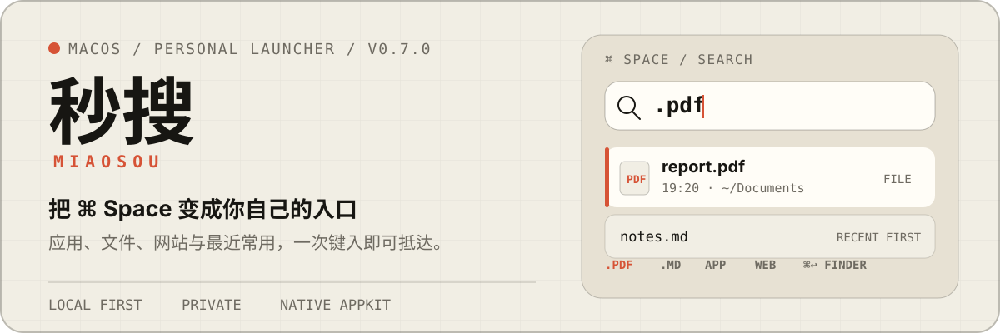
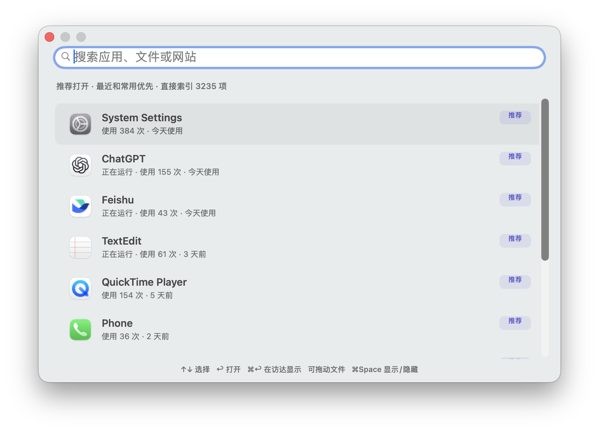
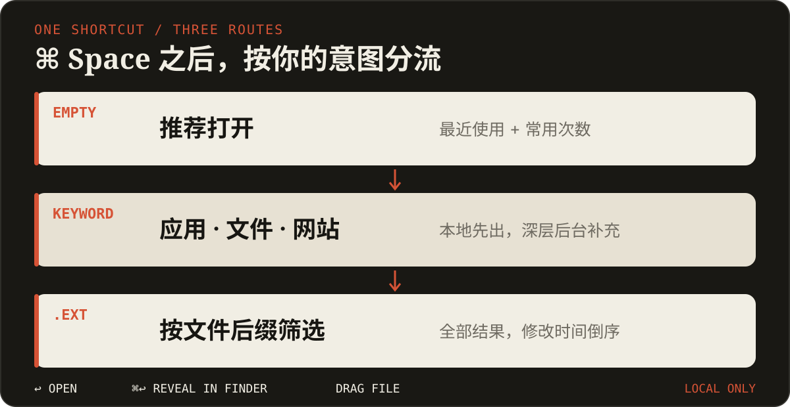

<p align="center">
  
</p>

<p align="center">
  <strong>比 Spotlight 更可控的个人 macOS 启动器。</strong><br>
  应用、文件、网站与最近常用，一次键入即可抵达。
</p>

<p align="center">
  <a href="https://github.com/tang730125633/miaosou/releases/latest"><strong>下载最新版</strong></a>
  · <a href="#从源码安装">从源码安装</a>
  · <a href="./bookmarks.json">网站书签</a>
</p>

## 先看成品

<p align="center">
  
</p>

按下 `⌘ Space`，秒搜会先给出最近和常用应用。开始输入后，应用、网站书签与本地文件立即出现，深层系统结果随后在后台补充。

## 它能做什么

- **替代 Spotlight 入口**：用 `⌘ Space` 显示或隐藏搜索窗口。
- **直接找到 App**：扫描系统与用户应用目录，不依赖 Spotlight 查找应用。
- **推荐常用应用**：读取本机使用次数、最近时间与运行状态，并排除当前应用。
- **关键词直达网站**：例如输入 `X`，回车后固定用 Chrome 打开 Twitter。
- **搜索文件与文件夹**：本地索引先反馈，`mdfind` 在后台补充深层结果。
- **点号后缀检索**：输入 `.` 查看常见类型；输入 `.pdf`、`.md`、`.docx` 等后缀后按修改时间排序。
- **中文输入法免切换**：输入 `。pdf` 会自动变成 `.pdf`；中文 `，` 和全角 `．` 也会转成英文标点。
- **隐藏配置模式**：输入 `@` 查看主目录下的 `.codex`、`.claude`、`.pi` 等隐藏配置；输入 `@codex` 可继续筛选，并按近 30 天改动活跃度排序。
- **打开、定位与拖放**：回车打开，`⌘↩` 或右键在访达中显示，文件结果可以直接拖到其他 App。

## 一条快捷键，四种路径

<p align="center">
  
</p>

| 输入 | 第一结果 |
| --- | --- |
| 留空 | 最近与常用应用推荐 |
| `shadow` | Shadowrocket 等应用 |
| `X` | X / Twitter 网站书签 |
| `.` | PDF、Markdown、Word、图片、视频等类型建议 |
| `.pdf` | 全部 PDF，最近修改优先 |
| `@` | 隐藏配置与点文件，近期改动优先 |
| `@codex` | 按名称筛选隐藏配置 |

## 30 秒安装

当前 Release 面向 **Apple Silicon（arm64）**，要求 macOS 13 或更新版本。

1. 从 [Releases](https://github.com/tang730125633/miaosou/releases/latest) 下载 `miaosou-v0.7.0-macos-arm64.zip`。
2. 解压后把 `秒搜.app` 放入 `Applications`。
3. 打开「系统设置 → 键盘 → 键盘快捷键 → Spotlight」，关闭“显示 Spotlight 搜索”。
4. 打开秒搜；首次搜索桌面、文稿或下载时，按需允许对应文件夹权限。

> 当前安装包使用本地临时签名，尚未使用 Apple Developer ID 公证。其他 Mac 首次运行时可能需要右键点击 App，选择“打开”。SHA-256 校验文件随 Release 一起提供。

## 键盘与拖放

| 操作 | 结果 |
| --- | --- |
| `⌘ Space` | 显示 / 隐藏秒搜 |
| `↑` / `↓` | 选择结果 |
| `↩` | 打开应用、文件或网站 |
| `⌘↩` | 在访达中显示文件 |
| `Esc` | 清空搜索；再次按下隐藏窗口 |
| 拖动文件行 | 把真实文件 URL 拖到访达或其他支持拖放的 App |

## 网站书签

书签由 [`bookmarks.json`](./bookmarks.json) 驱动。每项只包含标题、公开 URL 与关键词别名，不保存 Cookie、Token 或账号信息。

```json
{
  "title": "X / Twitter",
  "url": "https://x.com/home",
  "keywords": ["x", "twitter", "推特"]
}
```

修改配置后重新运行 `build.command` 即可。充值类书签只负责打开账户页面，不会自动充值或支付。

## 从源码安装

要求 Apple Command Line Tools。仓库不依赖第三方 Swift 包。

```bash
git clone https://github.com/tang730125633/miaosou.git
cd miaosou
./build.command
```

构建脚本会编译、自检、本地签名、安装到 `/Applications/秒搜.app`，登记登录项并打开应用。

验证命令：

```bash
/Applications/秒搜.app/Contents/MacOS/秒搜 --self-check
codesign --verify --deep --strict /Applications/秒搜.app
```

## 隐私与当前边界

- 使用统计、文件名与路径只在本机读取；秒搜不上传搜索词或个人画像。
- 打开网站书签时才会启动 Chrome 并访问对应公开 URL。
- 深层文件结果依赖 macOS 元数据索引；尚未建立持久数据库或文件正文索引。
- 超大后缀首次全量查询需要时间，例如数万条 Markdown 文件会在后台排序。
- 当前仅发布 arm64 构建；尚无 Intel / Universal 版本与 Apple 公证。

## 项目结构

```text
miaosou/
├── main.swift       # AppKit 应用、搜索、推荐、后缀模式与拖放
├── bookmarks.json   # 网站标题、URL 与关键词别名
├── Info.plist       # App 标识、版本与文件夹权限说明
├── build.command    # 编译、自检、签名、安装与启动
└── assets/readme/   # GitHub README 视觉资产与真实截图
```

## Release

- 最新版本：[秒搜 v0.7.0](https://github.com/tang730125633/miaosou/releases/tag/v0.7.0)
- 平台：macOS 13+ / Apple Silicon

## 开源协议

秒搜采用 [MIT License](./LICENSE) 开源，可自由使用、修改与分发，但需保留版权和许可声明。
